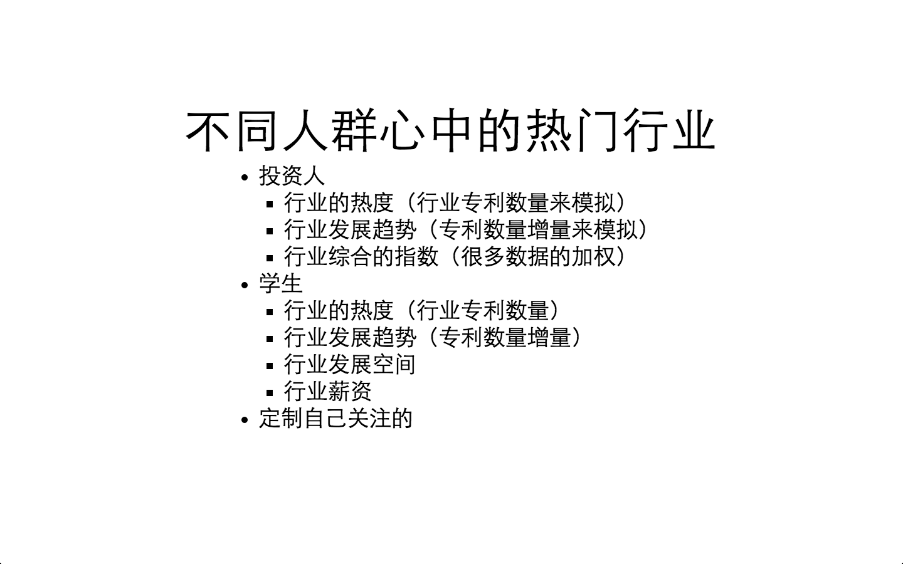
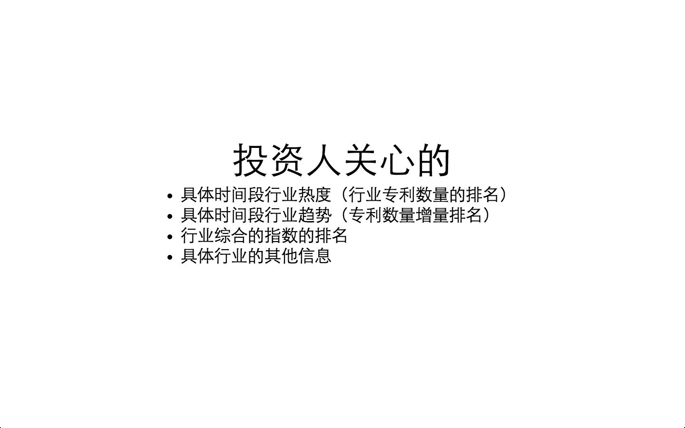
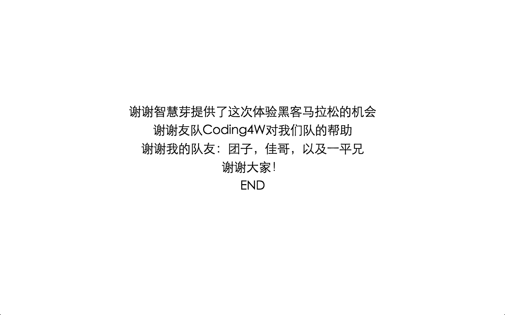

# 行业热度－寻找热门行业
> 本项目是2014年22日参加[智慧芽](http://www.patsnapglobal.com/index.php?app=cn&ac=patsnap)第二届黑客马拉松时做的项目。

本项目帮投资人，学生等人群寻找热门行业提供了参考。
目前只是个原型。要完成需要更多的纬度。

## 目前想到纬度
1. 行业的热度（行业专利数量来模拟）
1. 行业发展趋势（专利数量增量来模拟）
1. 行业综合的指数（很多数据的加权）

## 演示ppt
* 
* 
* 
* 

## 项目启动
1. 安装依赖 `npm i`
1. 启动 `npm start`
1. 打开浏览器，地址为 `http://127.0.0.1:3000/`

## 其他
* UI使用[semantic](http://semantic-ui.com/)
* 数据图表呈现，使用[echarts](http://echarts.baidu.com/index.html) [why?](http://echarts.baidu.com/doc/slide/whyEcharts.html）
* 行业的分类采用了[国际专利分类](http://www.wipo.int/classifications/ipc/zh/)

